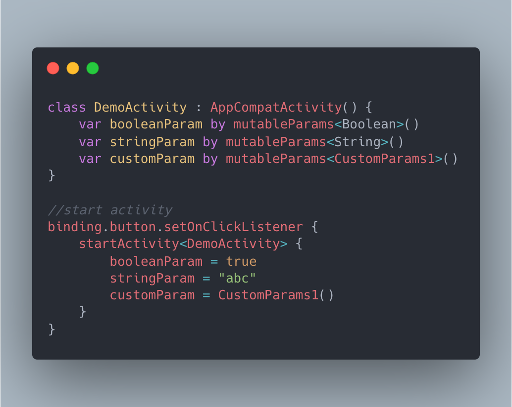

[](https://jitpack.io/#ssseasonnn/Bracer)

# Bracer

Pass parameters between Activity or Fragment like a master.

*Read this in other languages: [中文](README.zh.md), [English](README.md), [Change Log](CHANGELOG.md)*



## Prepare

### 1. Add the JitPack repository to your build file
```gradle
allprojects {
    repositories {
        ...
        maven { url 'https://jitpack.io' }
    }
}
```

### 2. Add the dependency

```gradle
dependencies {
	implementation 'com.github.ssseasonnn:Bracer:1.0.7'
}
```

## Usage

### 1. For Activity

```kotlin
class DemoActivity : AppCompatActivity() {
    //define
    var intParam by mutableParams<Int>()
    var booleanParam by mutableParams<Boolean>()
    var stringParam by mutableParams<String>()
    var customParam by mutableParams<CustomParams1>()

    override fun onCreate(savedInstanceState: Bundle?) {
        super.onCreate(savedInstanceState)

        //use
        println(intParams)
        println(booleanParams)
        println(stringParams)
        println(customParams)
    }
}
```

pass parameter to Activity：

```kotlin
binding.button.setOnClickListener {
    startActivity<DemoActivity> {
        intParam = 1
        booleanParam = true
        stringParam = "abc"
        customParam = CustomParams1()
    }
}

//or using tradition way：
val intent = Intent(context, DemoActivity::class.java)
intent.putExtra("intParam", 1.toByte())
intent.putExtra("booleanParam", true)
intent.putExtra("stringParam", "abc")
startActivity(intent)
```

> No need to worry, Bracer can be integrated with any third-party router, just ensure that the parameter name is the correspond

### 2. For Fragment

As Same

```kotlin
class DemoFragment : Fragment() {
    var intParam by mutableParams<Int>()
    var booleanParam by mutableParams<Boolean>()
    var stringParam by mutableParams<String>()
    var customParam by mutableParams<CustomParams1>()
}
```

pass parameter to Fragment

```kotlin
val fragment = DemoFragment().apply {
        intParam = 1
        booleanParam = true
        stringParam = "abc"
        customParam = CustomParams1()
}

supportFragmentManager.beginTransaction().apply {
        add(R.id.frameLayout, fragment)
        commit()
    }
```

### 3. Get parameters in ViewModel

```kotlin
//using SavedStateHandle
class DemoViewModel(private val stateHandle: SavedStateHandle) : ViewModel() {
    private val intParam by stateHandle.params<Int>()
    private val booleanParam by stateHandle.params<Boolean>()
    private val stringParam by stateHandle.params<String>()
    private val customParam by stateHandle.params<CustomParams1>()
}

//create ViewModel
class DemoActivity : AppCompatActivity() {
    var intParam by mutableParams<Int>()
    var booleanParam by mutableParams<Boolean>()
    var stringParam by mutableParams<String>()
    var customParam by mutableParams<CustomParams1>()

    //create ViewModel by viewModels extend function
    val viewModel by viewModels<DemoViewModel>()

    override fun onCreate(savedInstanceState: Bundle?) {
        super.onCreate(savedInstanceState)

        println(intParams)
        println(booleanParams)
        println(stringParams)
        println(customParams)
    }
}
```

> To use with viewModels extension function, you need to add dependencies：implementation 'androidx.fragment:fragment-ktx:1.5.1'

### 4. Get params from everywhere

You can use bracer anywhere, as long as you can get Activity or Fragment.

```kotlin
class TestAdapter(
    val activity: Activity,
    val fragment: Fragment,
    val intent: Intent,
    val bundle: Bundle
) {
    val paramFromActivity by activity.params<String>()
    val paramFromFragment by fragment.params<String>()
    val paramFromIntent by intent.params<String>()
    val paramFromBundle by bundle.params<String>()

    fun test(){
        val string by activity.params<String>()
    }
}
```

### 5. `val` 和 `var`

Bracer provides two types，`params` and `mutableParams`，corresponding to `val` and `var` in Kotlin.

```kotlin
//Read only
val param by params<String>()

//Read and Write
var mutableParams by mutableParams<String>()

```

### 6. Other Features

Custom key：

```kotlin
var customKeyParams by mutableParams<Byte>("this is custom key")
```

Default value：

```kotlin
var defaultParams by mutableParams<BigDecimal>(defaultValue = BigDecimal.ONE)
```


## License

> ```
> Copyright 2019 Season.Zlc
>
> Licensed under the Apache License, Version 2.0 (the "License");
> you may not use this file except in compliance with the License.
> You may obtain a copy of the License at
>
>    http://www.apache.org/licenses/LICENSE-2.0
>
> Unless required by applicable law or agreed to in writing, software
> distributed under the License is distributed on an "AS IS" BASIS,
> WITHOUT WARRANTIES OR CONDITIONS OF ANY KIND, either express or implied.
> See the License for the specific language governing permissions and
> limitations under the License.
> ```
